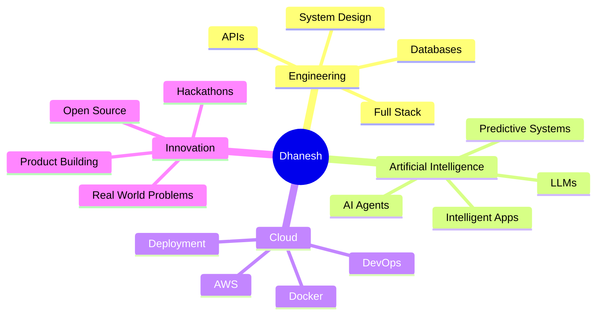

html
<div align="center">


<br/>

<a href="https://github.com/dhaneshit008">

</a>

<a href="https://github.com/dhaneshit008?tab=followers">

</a>

</div>

---

<div align="center">

# `> SYSTEM PROFILE INITIALIZED_`

</div>

```bash
$ whoami

Dhanesh

$ current_role

Aspiring Software Engineer
Full Stack Developer
AI Explorer

$ mission

"Build technology that solves problems worth solving."

$ status

████████████████████ 100%

READY TO BUILD.
````

---

# 👨‍💻 About Me

```yaml
developer:
  name: "Dhanesh"
  github: "@dhaneshit008"

  focus:
    - Full Stack Development
    - Artificial Intelligence
    - Cloud Computing
    - DevOps
    - Product Engineering

  currently:
    - Building real-world software products
    - Exploring AI-powered systems
    - Competing in hackathons
    - Improving cloud and development skills

  interests:
    - Software Engineering
    - AI / ML
    - Cloud Infrastructure
    - UI / UX
    - Problem Solving
    - Open Source

  philosophy: "Learn → Build → Break → Improve → Repeat"

  creative_mode: "Developer by Logic ⚡ Poet by Soul ✍🏻"
```

I love transforming **real-world problems into practical digital products**.

My projects often explore the intersection of **software engineering, artificial intelligence, cloud technology, education, agriculture and industry**.

> **I don't want to build software just because it can be built.
> I want to build things that deserve to exist.**

---

# ⚡ Tech Stack

<div align="center">

### `Languages`


<br/><br/>

### `Frontend`


<br/><br/>

### `Backend & Database`


<br/><br/>

### `Cloud • DevOps • Tools`


</div>

---

# 🚀 Projects I'm Proud Of

<table>

<tr>

<td width="50%" valign="top">

### 🤖 PredictX AI

**AI-Powered Predictive Maintenance Platform**

An intelligent Industry 4.0 platform designed to detect abnormalities, predict possible equipment failures and reduce unplanned downtime.

**Core ideas**

* Predictive failure detection
* Equipment health monitoring
* Anomaly identification
* Maintenance intelligence
* Industrial analytics

`AI` `Machine Learning` `Industry 4.0`

</td>

<td width="50%" valign="top">

### 🌾 UZHAVAN

**AI-Powered Agriculture Assistance**

A conversational AI ecosystem focused on making practical agricultural guidance accessible to farmers.

**Core ideas**

* AI farmer assistant
* Contextual agricultural support
* Rural-friendly interaction
* Decision assistance
* Multilingual potential

`Artificial Intelligence` `AgriTech` `LLM`

</td>

</tr>

<tr>

<td width="50%" valign="top">

### 🎓 Campus Connect

**Academic Social & Collaboration Platform**

A centralized digital platform that connects students, communities, departments and administrators.

**Core ideas**

* Academic communities
* Posts & announcements
* Role-based access
* Search & discovery
* Administrative tools

`React` `Node.js` `MySQL`

</td>

<td width="50%" valign="top">

### 🏫 CEC Portal

**Course Registration & Management System**

A digital system for simplifying external-course registrations and institutional course administration.

**Core ideas**

* Student registration
* Course management
* Admin dashboard
* Receipt & ID generation
* Payment workflow
* QR verification

`JavaScript` `Node.js` `MySQL` `Docker`

</td>

</tr>

</table>

<div align="center">

### `IDEA → CODE → PRODUCT → IMPACT`

</div>

---

# 📊 GitHub Analytics

<div align="center">


</div>

<br/>

<div align="center">


</div>

---

# 📈 Development Activity

<div align="center">


</div>

---

# 🐍 Contribution Journey

<div align="center">


</div>

---

# 🧠 Current Learning Map



---

# 🏆 Learning & Achievements

```text
╭──────────────────────────────────────────────────────────╮
│                                                          │
│  🏅 Cisco Networking Academy — Networking Basics         │
│  ☁️  Cloud Computing — Naan Mudhalvan                    │
│  🤖 TCS iON — YUVA AI For All                            │
│  💻 IBM SkillsBuild — Digital Literacy                   │
│  📊 IBM SkillsBuild — Project Management Fundamentals    │
│  🤝 IBM SkillsBuild — Effective Mentoring                │
│  🚀 Hackathons & National-Level Technical Events         │
│                                                          │
╰──────────────────────────────────────────────────────────╯
```

---

# 🧩 Developer Philosophy

```javascript
const dhanesh = {
    role: "Aspiring Software Engineer",

    mindset: [
        "Stay curious",
        "Build continuously",
        "Solve meaningful problems",
        "Learn from failure",
        "Never stop improving"
    ],

    domains: {
        software: true,
        artificialIntelligence: true,
        cloud: true,
        innovation: true
    },

    nextProject() {
        return "Something that probably started with: What if we could...?";
    }
};
```

---

# 🎯 Current Mission

<div align="center">

```text
┌──────────────────────────────────────────────────────┐
│                                                      │
│              BUILDING THE NEXT THING...              │
│                                                      │
│     [████████████████████████████████████] 100%      │
│                                                      │
│              CURIOSITY:     ONLINE                   │
│              CREATIVE MODE: ONLINE                   │
│              BUILD MODE:    ALWAYS ON                │
│                                                      │
└──────────────────────────────────────────────────────┘
```

</div>

---

# ✍🏻 The Other Side of Me

<div align="center">

### `</code> meets கவிதை`

**Developer by Logic ⚡ Poet by Soul ✍🏻**

> சில வரிகள் நிரலாகின்றன.
> சில வரிகள் கவிதையாகின்றன.
> இரண்டிலும் நான் என்னையே எழுதுகிறேன்.

</div>

---

# 🤝 Let's Connect

<div align="center">

<a href="https://github.com/dhaneshit008">

</a>

<br/><br/>

**Open to**

`Hackathons` • `Open Source` • `Collaborations` • `Innovative Projects` • `Learning`

</div>

---

<div align="center">

### `while(alive) { learn(); build(); improve(); }`

<br/>

**⚡ CODE • CREATE • IMPACT ⚡**


</div>
```
